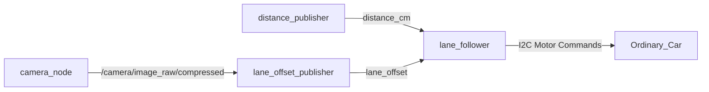

# Meebo (ETW3 - Team 03) 🚗🤖

Welcome to Team 03's ROS 2 workspace for the ETW III autonomous robot project ("Meebo"). This repository contains our ROS 2 packages for computer vision lane detection, ultrasonic distance safety sensing, and motor control running on the Raspberry Pi 4.

---

## 📂 Repository Structure

* **`src/`**: Contains all ROS 2 packages and driver interfaces:
  * **`etw3_team03/`**: Core team package:
    * `vision_nodes/`: Vision pipelines (`lane_offset_publisher`, `experimental_lane_detector`, `frame_saver`).
    * `safety_nodes/`: Closed-loop controllers (`lane_follower`, `experimental_lane_follower`, `estop_node`).
    * `sensor_nodes/`: Ultrasonic distance publisher (`distance_publisher`) and watcher (`distance_watch`).
    * `Ashin_Experimental/`: Advanced autonomous driving suite and Web Teleop Dashboard.
  * **`freenove_driver/`**: Low-level I2C hardware drivers for DC motors (PCA9685), servo steering, and ultrasonic sensor.
  * **`teleop_bridge/`**: Command velocity bridge (`cmd_vel_bridge`).
* **`build.sh`**: One-click build script (`colcon build --symlink-install`).
* **`start_experimental.sh`**: One-click launcher for the autonomous driving suite.
* **`kill_all.sh`**: Master cleanup script to terminate all nodes and safely zero motors.
* **`sync.sh`**: Branch-aware helper script to pull latest updates and rebuild workspace.

---

## 🏎️ Standard Lane Follower Pipeline

The baseline lane follower provides closed-loop proportional-derivative (PD) line tracking between two parallel tape lines.

### Architecture



### 1. Vision Processing (`lane_offset_publisher.py`)
* **Color Thresholding**: HSV segmentation (`HSV_LOWER=[0,0,0]`, `HSV_UPPER=[180,255,110]`) isolating black tape lines on light flooring.
* **Region of Interest (ROI)**: Horizon-safe cropping (`Rows 144–240` on 480p) to reject ambient room reflections and background objects.
* **Relative Sorting & Midpoint Calculation**: Identifies left and right tape contours relative to each other and calculates normalized center offset ($-1.0 = \text{far left}$, $0.0 = \text{center}$, $+1.0 = \text{far right}$).
* **Temporal Association**: Maintains frame-to-frame tape continuity to prevent jumping to spurious dark patches.
* **Jump Debounce**: Two-frame confirmation threshold (`MAX_OFFSET_JUMP = 0.35`) rejecting single-frame visual glitches.

### 2. Closed-Loop Motor Control (`lane_follower.py`)
* **PD Steering Control**:
  $$\text{target\_adjustment} = \text{STEER\_SIGN} \times (KP \cdot \text{error} + KD \cdot \text{derivative}) \times \text{BASE\_DUTY}$$
* **Parameters**:
  * `BASE_DUTY = 480`: Standard cruising speed.
  * `KP = 2.8`, `KD = 0.15`: Steering gains.
  * `CENTER_TOLERANCE = 0.015`: Tight center deadband preventing open-loop drift.
  * `MAX_ADJUSTMENT_STEP = 90`: Slew-rate rate limiter preventing abrupt steering snaps.
  * `STOP_DISTANCE_CM = 65`: Emergency stop threshold.
* **Per-Wheel Gain Calibration**: Multipliers (`WHEEL_GAIN_*`) to balance physical motor strength asymmetry.

---

## 🚀 Running the Robot

### 1. Build Workspace
```bash
cd ~/etw3_ws
git pull origin main
./build.sh
```

### 2. Launch Standard Autonomous Suite
```bash
# Terminal 1: Camera Node (640x480)
ros2 run camera_ros camera_node --ros-args -p width:=640 -p height:=480

# Terminal 2: Distance Sensor
ros2 run sensor_nodes distance_publisher

# Terminal 3: Lane Offset Publisher
ros2 run vision_nodes lane_offset_publisher

# Terminal 4: Lane Follower
ros2 run safety_nodes lane_follower
```

---

## 🧪 Advanced Experimental Driving Suite

For high-speed cruise, predictive curvature lookahead, adaptive cornering for sharp 90-degree bends, memory-guided track search/recovery, and live web teleoperation, see the dedicated experimental documentation:

👉 **[📖 Read the Detailed Experimental Suite Documentation](src/etw3_team03/Ashin_Experimental/README.md)**

To launch the experimental suite directly:
```bash
./start_experimental.sh
```

---

## 🛠️ Useful Utility Scripts

* **Emergency Kill & Motor Zero**:
  ```bash
  ./kill_all.sh
  ```
* **Git Pull & Workspace Rebuild**:
  ```bash
  ./sync.sh
  ```
* **Direct Motor Driver Test**:
  ```python
  from freenove_driver.motor import Ordinary_Car
  car = Ordinary_Car()
  car.set_motor_model(0, 0, 0, 0)
  car.close()
  ```

---

## 👥 Team 03
* **Ashin** ([@AshinMc](https://github.com/AshinMc))
* **Taseeb** ([@taseebali](https://github.com/taseebali))
