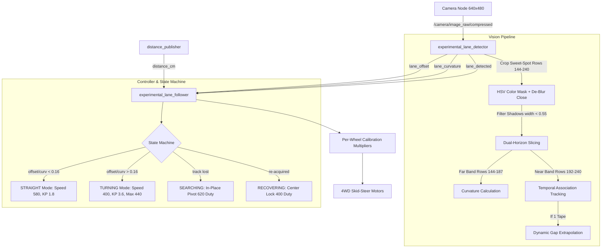

# 🧪 Experimental Autonomous Driving Suite

Welcome to the **Experimental Autonomous Driving & Teleoperation Suite** for Team 03's ROS 2 robot ("Meebo"). This suite implements high-performance computer vision, predictive curvature steering, adaptive cornering speed control, and memory-guided track recovery.

---

## 🌟 Overview & Architecture



---

## 👁️ 1. Vision Engine (`experimental_lane_detector.py`)

### 📐 A. Optical Sweet-Spot ROI (Rows `144 – 240` px)
* **The Perspective Problem**: Because the camera is mounted low to the chassis, ground closer than row 250 spreads wider than the camera's horizontal field of view ($> 640\text{px}$), causing tape lines to exit the screen edges. Conversely, ground above row 140 catches background room clutter (shoes, chair legs, shiny chrome stool reflections).
* **The Solution**: Slicing rows **`144 to 240`** (30%–50% frame height) guarantees both tape lines remain cleanly in frame with 100px+ margins on both sides.

### 🔭 B. Dual-Horizon Sub-Bands
* **Far Lookahead Band (Rows 144–187)**: Peeks ~1.5m–2.5m ahead down the track to calculate upcoming curve angle ($\text{curvature} = \text{offset}_{\text{far}} - \text{offset}_{\text{near}}$) *before* the wheels enter the bend.
* **Near Centering Band (Rows 192–240)**: Measures immediate lateral error for closed-loop centering.

### 🧬 C. Temporal Association Tracking
* Instead of re-deciding tape picks by raw contour area from scratch every frame (which caused flip-flops between tape and background objects), the detector remembers tape positions (`prev_left_x`, `prev_right_x`) and matches candidates based on **frame-to-frame continuity**.
* If a single tape is seen, it determines whether it is the left or right line based on proximity to the remembered coordinates.

### 🌉 D. Dynamic Single-Tape Continuous Gap Memory (`MAX_SINGLE_TAPE_STREAK = 35`)
* When both tapes are visible, the detector continuously measures the real lane half-width (`last_half_gap_px`).
* On sharp 90° elbow turns where the inner tape cuts sharply out of view, the detector extrapolates the lane center from the outer tape ($\text{lane\_cx} = \text{outer\_x} \pm \text{last\_half\_gap}$) for up to **35 frames (~1.75s)**, allowing the robot to steer smoothly all the way through the corner exit.

### 🛡️ E. Geometry & Shadow Filters
* **`MAX_CONTOUR_WIDTH_FRAC = 0.55`**: Accommodates thick multi-strip corner splices and angled lines while discarding full-screen shadows.
* **`MAX_OFFSET_JUMP = 0.35`**: Two-frame debounce filter that rejects 1-frame visual glitches.
* **`MORPH_CLOSE` (`7x3` kernel)**: Fuses segmented piecewise tape splices into continuous lines.

---

## 🏎️ 2. Adaptive Control & State Machine (`experimental_lane_follower.py`)

### ⚡ A. Multi-Profile Driving Modes

| Driving Mode | Base Duty | KP | KD | Max Adjust | Slew Step | Behavior & Purpose |
| :--- | :--- | :--- | :--- | :--- | :--- | :--- |
| **`STRAIGHT`** | `580` | `1.8` | `0.15` | `260` | `75` | Fast, confident cruise on straightaways. |
| **`TURNING`** | `400` | `3.6` | `0.25` | `440` | `150` | High-torque tight turning radius; inner wheels reverse to pivot sharply on 90° bends. |
| **`RECOVERING`** | `400` | `2.8` | `0.18` | `320` | `80` | Smooth re-centering lock when track is re-acquired. |
| **`SEARCHING`** | `0` | — | — | — | — | In-place pivot at **`620` duty** toward last-seen track side. |

### 🎯 B. Predictive PD + Curvature Feed-Forward
Steering adjustment incorporates rate-of-change derivative smoothing and lookahead curvature:
```python
target_adjustment = STEER_SIGN * (KP * error + KD * derivative + K_curv * curvature) * base_duty
```

### ⚖️ C. Per-Wheel Power Calibration
Compensates for chassis motor strength asymmetry:
```python
WHEEL_GAIN_FRONT_LEFT  = 1.00
WHEEL_GAIN_BACK_LEFT   = 1.00
WHEEL_GAIN_FRONT_RIGHT = 1.00
WHEEL_GAIN_BACK_RIGHT  = 1.00
```

### 🔄 D. Memory-Guided Track Search & Recovery
1. **Directional Memory**: Remembers whether the track was on the LEFT or RIGHT.
2. **Phase 1 (0.0s – 1.2s)**: Pivots in-place toward the last-known direction at `620` duty.
3. **Phase 2 (1.2s – 3.0s)**: Reverses sweep direction to check the opposite side.
4. **Safety Abort (5.0s)**: Halts motors completely if lines are not found within 5 seconds.

---

## 🎮 3. Web Teleoperation & Live Video Dashboard

Located in `src/etw3_team03/Ashin_Experimental/`:
* **`web_teleop_node.py`**: Lightweight HTTP/WebSocket server streaming live camera feed with WASD / Touch / Gamepad control.
* **Launch Teleop**:
  ```bash
  cd ~/etw3_ws/src/etw3_team03/Ashin_Experimental
  ./start_teleop.sh
  ```
  Open `http://<pi-ip-address>:8000` in any web browser.

---

## 🚀 4. How to Launch the Experimental Suite

```bash
cd ~/etw3_ws
git checkout main
git pull origin main
./build.sh
./start_experimental.sh
```

*(To immediately halt all nodes and zero motors from another shell: `./kill_all.sh`)*
